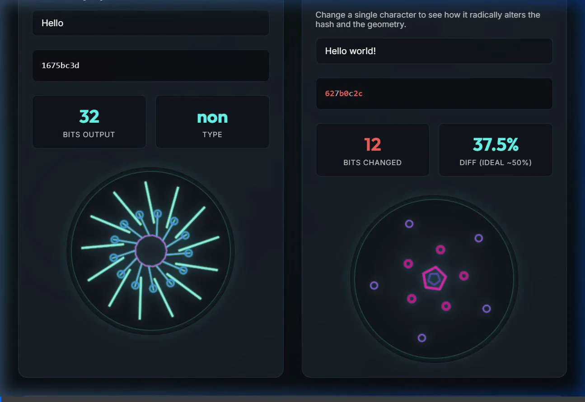

# Cryptographic Hash Visualization Tool

A web-based interactive visualization tool that maps cryptographic and non-cryptographic hashes to generative geometric patterns (Voronoi diagrams).

## Features

### 1. Hash Algorithms (Pure JS)
Pure JavaScript implementations built from scratch without external dependencies for:
- **FNV-1 (64-bit)**
- **FNV-1a (64-bit)**
- **MurmurHash3 (32-bit)**
- **MD5 (128-bit)**
- **SHA-1 (160-bit)**
- **SHA-256 (256-bit)**

### 2. Pure JS Voronoi Visualizer
The visualization engine uses a **Voronoi Diagram**.
- **The Algorithm**: The diagram is drawn using a pure JavaScript pixel-based distance calculation on an HTML5 `<canvas>`. Absolutely no visualization libraries like D3 were used.
- **Data Mapping**: Chunks of the hash binary are used to place seed points `(X,Y)` and define their base hues.
- Every single pixel calculates its distance to these seed points to draw crisp, mathematical boundaries where the distances equalize.

### 3. Visual Avalanche Effect
The Voronoi diagram beautifully illustrates the Avalanche Effect. 
Changing a single character completely scrambles the hash bits. This means entirely new `(X,Y)` coordinate pairs are generated for the seed points, resulting in a completely unrecognizable Voronoi diagram compared to the original input. The bit difference is highlighted, proving an ideal ~50% Hamming Distance variation for the cryptographic algorithms!

### 4. Performance Benchmarks
The benchmarking tab correctly iterates through the pure JS functions 5,000 times to compare their computational costs in real-time.

## Demonstration

## How to Run Locally

1. Clone this repository.
2. Navigate to the project directory.
3. Install dependencies: `npm install`
4. Start the development server: `npm run dev`
5. Open the displayed URL in your browser.
